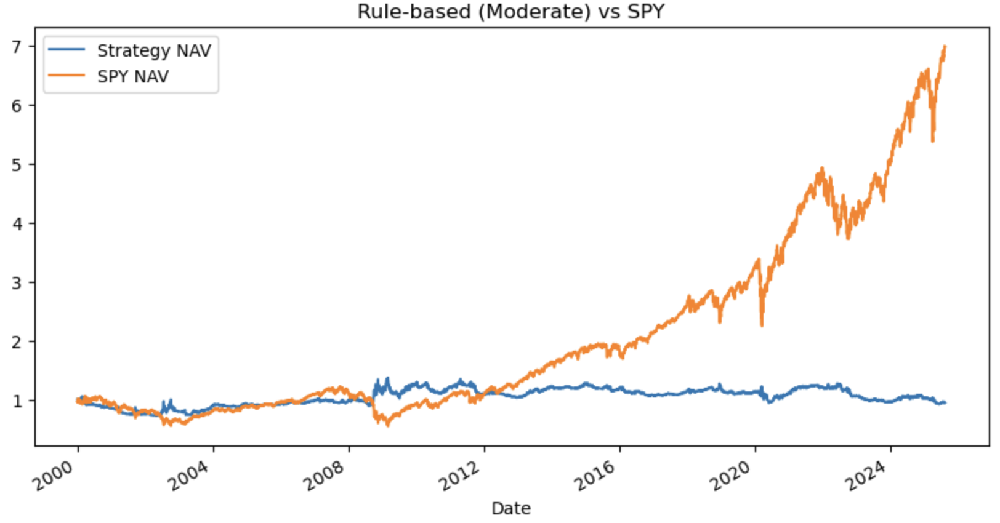

# Multi-Level ETF Trading System with Risk Tolerance Cutoffs

## Overview
This project develops and evaluates an automated trading system for exchange-traded funds (ETFs).  
The system converts predictive signals into **Buy, Hold, or Sell** actions, with **risk-tolerance–specific cutoffs** that determine how aggressively signals are acted upon.  
Two strategies are implemented:

- **Rule-based strategy**: decisions guided by technical indicators such as moving averages and momentum.  
- **Machine learning–based strategy**: logistic regression classifiers predicting next-day returns.  

Performance is benchmarked against a buy-and-hold position in the S&P 500 ETF (SPY).

---

## Data
- **Source**: Daily closing price data for nine ETFs: SPY, GLD, VGT, VB, IVE, XLI, XLU, SLV, and USO.  
- **Format**: CSV files with at least `Date` and `Close` columns.  
- **Features engineered**:
  - 1-day momentum (yesterday vs. the day before)  
  - 40-day vs. 80-day EMAs (trend strength)  
  - 20-day rolling volatility  
  - (Optional) volume-based features  

---

## Research Design
**Rule-based strategy**  
Scores were calculated from EMA gaps and momentum, then mapped to trading actions according to cutoffs reflecting low, moderate, or high risk tolerance. Portfolios were equal-weighted across ETFs and rebalanced daily into long, short, or neutral positions.  

**ML-based strategy**  
Logistic regression models were trained for each ETF using 70% of the data for training and 30% for testing. Features included daily return, EMA gap, and volatility. The model outputs—the probability of a next-day increase—were mapped to continuous scores with  
`score = (p_up - 0.5) * 200`
and the same cutoffs were applied to determine Buy/Hold/Sell actions.  

---
## Implementation
- **Languages/Libraries**: Python, pandas, numpy, scikit-learn, matplotlib  
- **Main file**:  
  - `trading_assignment.ipynb` – includes data preparation, strategy implementation, backtesting, and visualization  
- **Report**:  
  - `Assignment_Report_MultiLevelTrading.pdf` – final written report  

To reproduce results, open the notebook and run all cells in order.

---

## Results

### Rule-based Strategy vs. SPY NAV
The rule-based design produced a **final NAV of 0.94**, underperforming the SPY benchmark.  
This shows that simple EMA–momentum heuristics, even when adjusted for risk tolerance, failed to capture sustained market trends.  

  
*Figure 1. Cumulative NAV of the rule-based strategy compared with SPY.*  

---

### ML-based Strategy vs. SPY NAV
The ML-based strategy achieved a **final NAV of 1.18**, which is modestly better than the rule-based design but still far below SPY’s sixfold growth over the same period.  
AUC scores for individual ETFs were between 0.48 and 0.53, indicating near-random predictive power.  

  
*Figure 2. Cumulative NAV of the ML-based strategy compared with SPY.*  

---

## Future Work
- Extend momentum signals beyond daily horizons  
- Incorporate volume and macroeconomic indicators  
- Test advanced models such as ensemble methods or neural networks  
- Use dynamic portfolio weighting instead of equal-weight allocations  
- Refine transaction cost modeling for realistic execution  

---

## Author
**Chenyi Zhao** – Northwestern University  
Course: *MSDS 451 - Financial Engineering*  
Date: Fall 2025

